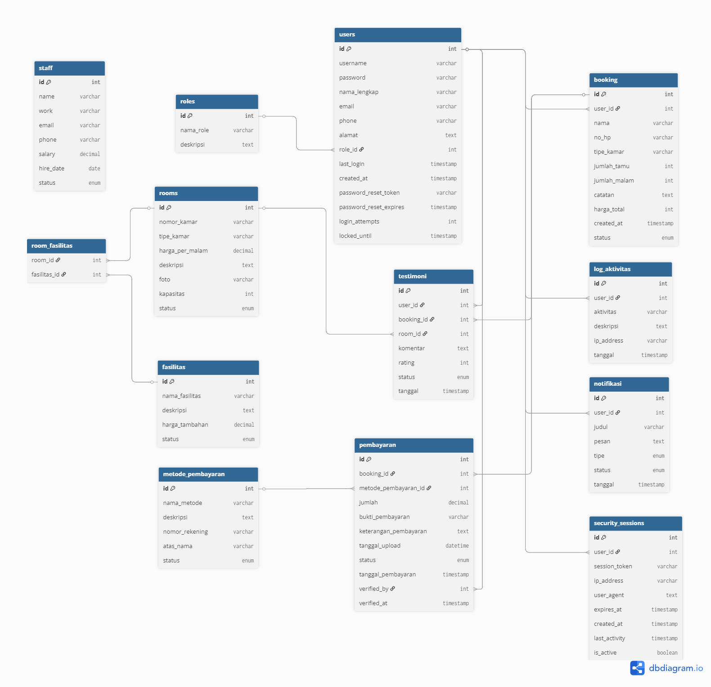

# 🏨 HotelEase - Sistem Manajemen Hotel

<div align="center">


[](https://php.net)
[](https://mysql.com)
[](https://getbootstrap.com)
[](https://javascript.com)

**Sistem Manajemen Hotel Modern dengan Interface yang Elegan dan Fitur Lengkap**

[📖 Dokumentasi](#dokumentasi) • [🚀 Demo](#demo) • [💾 Installation](docs/Installation.md) • [📊 Database](docs/Database.md)

</div>

---

## 📋 Deskripsi Proyek

HotelEase adalah sistem manajemen hotel berbasis web yang dirancang untuk memudahkan pengelolaan operasional hotel. Sistem ini menggabungkan antarmuka pengguna yang modern dengan fungsionalitas yang komprehensif, memungkinkan manajemen yang efisien untuk booking kamar, pembayaran, staff, dan laporan analytics.

### ✨ Fitur Utama

- **🏨 Manajemen Kamar**: CRUD kamar dengan tipe, harga, dan fasilitas
- **📅 Sistem Booking**: Booking real-time dengan validasi ketersediaan
- **💳 Manajemen Pembayaran**: Multiple payment methods dengan tracking status
- **👥 Manajemen Staff**: Pengelolaan data karyawan dan tugas
- **👤 Manajemen User**: Role-based access (Admin & Customer)
- **🏢 Manajemen Fasilitas**: CRUD fasilitas hotel
- **📊 Laporan Analytics**: Dashboard dan laporan komprehensif PDF
- **🔐 Sistem Autentikasi**: Login/Register dengan session management
- **📱 Responsive Design**: Compatible dengan desktop dan mobile
- **🎨 Modern UI/UX**: Clean interface dengan Bootstrap 5

### ✨ Link Youtube dan Hosting

- **Link Youtube : 
- **Link Hosting : https://putri.mangaverse.my.id/

## 🛠️ Teknologi yang Digunakan

### Backend
- **PHP 7.4+** - Server-side scripting
- **MySQL 8.0+** - Database management
- **PDO/MySQLi** - Database connectivity

### Frontend
- **HTML5** - Markup structure
- **CSS3** - Styling dengan custom properties
- **JavaScript ES6+** - Interactive functionality
- **Bootstrap 5.3** - UI framework
- **Bootstrap Icons** - Icon library

### Tools & Libraries
- **XAMPP** - Local development environment
- **Chart.js** - Data visualization
- **Custom CSS** - Advanced styling
- **Session Management** - User authentication

## 📂 Struktur Proyek

```
backup.putri/
├── 📁 admin/                    # Panel Admin
│   ├── booking_admin.php        # Manajemen booking
│   ├── dashboard.php            # Dashboard admin
│   ├── export_pdf.php           # Export laporan PDF
│   ├── fasilitas.php           # Manajemen fasilitas
│   ├── kamar.php               # Manajemen kamar
│   ├── metode_pembayaran.php   # Manajemen payment methods
│   ├── pembayaran.php          # Manajemen pembayaran
│   ├── reports.php             # Laporan & analytics
│   ├── sidebar.php             # Navigation sidebar
│   ├── staff.php               # Manajemen staff
│   └── users.php               # Manajemen users
├── 📁 assets/                   # Static assets
│   ├── 📁 css/                 # Stylesheets
│   ├── 📁 js/                  # JavaScript files
│   └── style.css               # Main stylesheet
├── 📁 auth/                     # Authentication
│   ├── login.php               # Login page
│   ├── register.php            # Registration page
│   ├── logout.php              # Logout handler
│   └── proses_*.php            # Auth processors
├── 📁 config/                   # Configuration
│   ├── koneksi.php             # Database connection
│   └── helpers.php             # Helper functions
├── 📁 docs/                     # Documentation
│   ├── Database.md             # Database documentation
│   ├── Deployment.md           # Deployment guide
│   ├── Installation.md         # Installation guide
│   ├── Usage.md                # Usage documentation
│   └── erd_diagram.png         # ERD diagram
├── 📁 user/                     # User Panel
│   ├── booking.php             # User booking
│   ├── dashboard.php           # User dashboard
│   ├── profil.php              # User profile
│   ├── riwayat.php            # Booking history
│   └── transaksi.php          # Transaction history
├── index.php                   # Landing page
└── README.md                   # This file
```

## 🎯 Target Pengguna

### 👨‍💼 Administrator Hotel
- Mengelola seluruh aspek operasional hotel
- Monitoring booking dan pembayaran
- Generate laporan dan analytics
- Manajemen staff dan fasilitas

### 👤 Customer/Tamu Hotel
- Melakukan booking kamar online
- Melihat fasilitas yang tersedia
- Tracking status booking dan pembayaran
- Mengelola profil personal

## 🚀 Fitur Unggulan

### 📊 Dashboard Analytics
- **Real-time metrics** - Total pendapatan, booking, pembayaran
- **Interactive charts** - Tren pendapatan bulanan
- **Status overview** - Breakdown status booking
- **Quick actions** - Akses cepat ke fitur utama

### 📑 Laporan Komprehensif
- **Unified PDF Export** - Menggabungkan data booking dan pembayaran
- **Clean & Professional Design** - Layout yang mewah dan mudah dibaca
- **Comprehensive Data** - Statistik metode pembayaran, tren bulanan
- **Print-friendly** - Optimized untuk cetak A4

### 🎨 Modern UI/UX
- **Responsive Design** - Adaptif untuk semua device
- **Clean Interface** - Minimalist dan user-friendly
- **Smooth Animations** - Transition yang halus
- **Consistent Branding** - Gold theme yang elegan

### 🔒 Keamanan
- **Role-based Access Control** - Admin dan User terpisah
- **Session Management** - Secure login/logout
- **Input Validation** - Protection against injection
- **CSRF Protection** - Form security

## 📊 Database Schema

Sistem menggunakan 7 tabel utama:

| Tabel | Fungsi | Records |
|-------|--------|---------|
| `users` | Data pengguna (admin/customer) | User accounts |
| `kamar` | Data kamar hotel | Room information |
| `fasilitas` | Fasilitas hotel | Hotel facilities |
| `staff` | Data karyawan | Staff management |
| `booking` | Data reservasi | Booking records |
| `pembayaran` | Data pembayaran | Payment transactions |
| `metode_pembayaran` | Metode pembayaran | Payment methods |

### 🗂️ Entity Relationship Diagram (ERD)



*Entity Relationship Diagram menunjukkan relasi antar tabel dalam database HotelEase. Diagram ini memvisualisasikan foreign key relationships, primary keys, dan struktur data yang mendukung seluruh fungsionalitas sistem.*

**Key Relationships:**
- `users` ↔ `booking` (One-to-Many)
- `booking` ↔ `pembayaran` (One-to-Many)  
- `metode_pembayaran` ↔ `pembayaran` (One-to-Many)

Lihat [Database Documentation](docs/Database.md) untuk detail lengkap schema dan queries.

## 🚀 Quick Start

### Prerequisites
- XAMPP/WAMP/LAMP dengan PHP 7.4+
- MySQL 8.0+
- Web browser modern

### Installation
```bash
# 1. Clone atau download project
git clone [repository-url] backup.putri

# 2. Copy ke htdocs XAMPP
cp -r backup.putri /path/to/xampp/htdocs/

# 3. Import database
mysql -u root -p < backup.putri/database/hotelease.sql

# 4. Konfigurasi database
# Edit config/koneksi.php sesuai setting MySQL

# 5. Akses aplikasi
http://localhost/backup.putri
```

Lihat [Installation Guide](docs/Installation.md) untuk petunjuk detail.

## 📖 Dokumentasi Lengkap

### 📚 Panduan Utama

| Dokumen | Deskripsi | Audience | Status |
|---------|-----------|----------|--------|
| [🚀 **Installation Guide**](docs/Installation.md) | Panduan instalasi lengkap dari development hingga production | Developer, Admin | ✅ Complete |
| [📋 **Usage Documentation**](docs/Usage.md) | Cara penggunaan sistem untuk Admin dan Customer | All Users | ✅ Complete |
| [📊 **Database Documentation**](docs/Database.md) | Schema database, ERD, dan optimisasi query | Developer, DBA | ✅ Complete |
| [🌍 **Deployment Guide**](docs/Deployment.md) | Panduan deploy ke shared hosting dan VPS/Cloud | DevOps, Admin | ✅ Complete |
| [🗂️ **ERD Diagram**](docs/erd_diagram.png) | Entity Relationship Diagram visual | Developer, DBA | ✅ Available |

### 🎯 Quick Navigation

#### 👨‍💻 Untuk Developer
```
1. 🚀 Setup Environment     → Installation.md
2. 📊 Pahami Database       → Database.md + ERD Diagram
3. 📋 Pelajari Fitur        → Usage.md
4. 🌍 Deploy ke Production  → Deployment.md
```

#### 👨‍💼 Untuk Administrator Hotel
```
1. 🚀 Install Sistem        → Installation.md → "First Run"
2. 📋 Kelola Hotel          → Usage.md → "Admin Panel"
3. 📊 Generate Reports      → Usage.md → "Reports & Analytics"
4. 🌍 Go Live               → Deployment.md → "Production"
```

#### 👤 Untuk Customer/Tamu
```
1. 📋 Cara Booking          → Usage.md → "User Panel" 
2. 💳 Proses Pembayaran     → Usage.md → "Payment Process"
3. 📜 Lihat Riwayat         → Usage.md → "Booking History"
4. 👤 Kelola Profil         → Usage.md → "Profile Management"
```

### 📂 Detail Dokumentasi

#### 🚀 Installation Guide ([docs/Installation.md](docs/Installation.md))
- ✅ **Prerequisites** - Server requirements & tools
- ✅ **Download & Setup** - Project setup methods
- ✅ **Database Configuration** - MySQL setup & import
- ✅ **System Configuration** - PHP & permissions
- ✅ **First Run** - Initial setup & verification
- ✅ **Troubleshooting** - Common issues & solutions

#### 📋 Usage Documentation ([docs/Usage.md](docs/Usage.md))
- ✅ **Authentication** - Login, register, session management
- ✅ **Admin Panel** - Dashboard, CRUD operations, reports
  - 🏨 Room Management - Kamar CRUD dengan upload gambar
  - 📅 Booking Management - Konfirmasi & tracking reservasi
  - 💳 Payment Management - Verifikasi pembayaran
  - 👥 Staff Management - Kelola data karyawan
  - 📊 Analytics & Reports - Dashboard real-time & PDF export
- ✅ **User Panel** - Customer features & self-service
  - 🏨 Room Catalog - Browse & filter kamar tersedia  
  - 📅 Easy Booking - Proses booking yang intuitif
  - 💳 Payment Upload - Upload bukti pembayaran
  - 📜 History Tracking - Riwayat booking & transaksi
- ✅ **Mobile Experience** - Responsive design tips
- ✅ **Security Features** - Best practices & guidelines

#### 📊 Database Documentation ([docs/Database.md](docs/Database.md))
- ✅ **Schema Overview** - 7 tabel utama dengan relasi
- ✅ **ERD Diagram** - Visual database structure
- ✅ **Table Details** - Struktur setiap tabel dengan field description
- ✅ **Relationships** - Foreign keys & referential integrity
- ✅ **Sample Queries** - Authentication, reporting, analytics
- ✅ **Optimization** - Indexing, performance tuning
- ✅ **Security** - Data validation, constraints

#### 🌍 Deployment Guide ([docs/Deployment.md](docs/Deployment.md))
- ✅ **Pre-deployment Checklist** - Code review & security
- ✅ **Shared Hosting** - cPanel, FTP upload, database setup
- ✅ **VPS/Cloud Server** - LAMP stack, Apache configuration
- ✅ **Domain & SSL** - DNS setup, Let's Encrypt certificate
- ✅ **Production Config** - PHP settings, environment variables
- ✅ **Performance Optimization** - Caching, compression, CDN
- ✅ **Security Hardening** - Firewall, Fail2Ban, input validation
- ✅ **Monitoring & Maintenance** - Backups, logging, updates

## 🎨 Screenshots

### 🏠 Landing Page
Modern landing page dengan hero section dan fitur overview

### 👨‍💼 Admin Dashboard
Comprehensive dashboard dengan real-time analytics dan quick actions

### 📱 User Interface
Clean dan responsive interface untuk booking dan management

### 📊 Reports & Analytics
Professional PDF reports dengan data visualization

## 🔧 Development

### Local Development
```bash
# Start XAMPP services
sudo /opt/lampp/lampp start

# Access development site
http://localhost/backup.putri

# Database management
http://localhost/phpmyadmin
```

### Code Structure
- **MVC Pattern** - Separation of concerns
- **Responsive Design** - Mobile-first approach
- **Modular Components** - Reusable code blocks
- **Security Best Practices** - Input validation & sanitization

## 🤝 Contributing

Kontribusi selalu diterima! Silakan:

1. Fork repository
2. Create feature branch (`git checkout -b feature/AmazingFeature`)
3. Commit changes (`git commit -m 'Add AmazingFeature'`)
4. Push to branch (`git push origin feature/AmazingFeature`)
5. Open Pull Request

## 📄 License

Project ini dibuat untuk keperluan akademik - Ujian Akhir Semester Pemrograman Web.

## 👨‍💻 Author

**Putri Nabila Az Zahra**
- 🎓 **NIM**: 202312045
- 📧 **Email**: putrin151204@gmail.com
- 📚 **Proyek**: Ujian Akhir Semester - Pemrograman Web
- 🏫 **Institusi**: Sekolah Tinggi Teknologi Bontang

---

## 📞 Support

Jika Anda mengalami masalah atau memiliki pertanyaan:

- 📧 Email: putrin151204@gmail.com
- 📖 Baca [dokumentasi lengkap](docs/)
- 🐛 Laporkan bug melalui issues

---

<div align="center">

**⭐ Don't forget to star this repository if it helped you! ⭐**

Made with ❤️ by [Putri Nabila Az Zahra](mailto:putrin151204@gmail.com)

*HotelEase - Revolutionizing Hotel Management* 🏨

</div>
